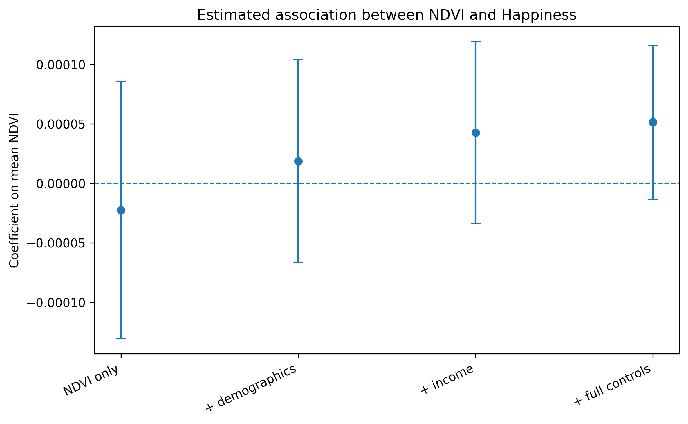
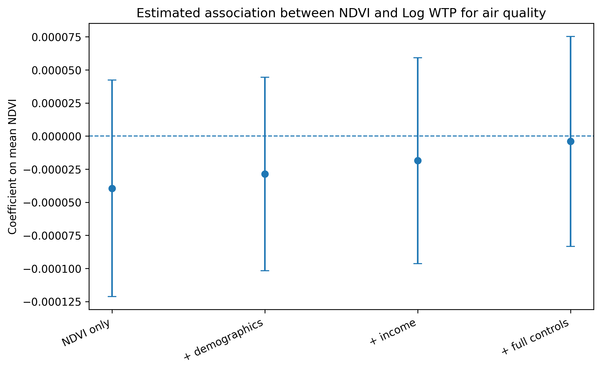
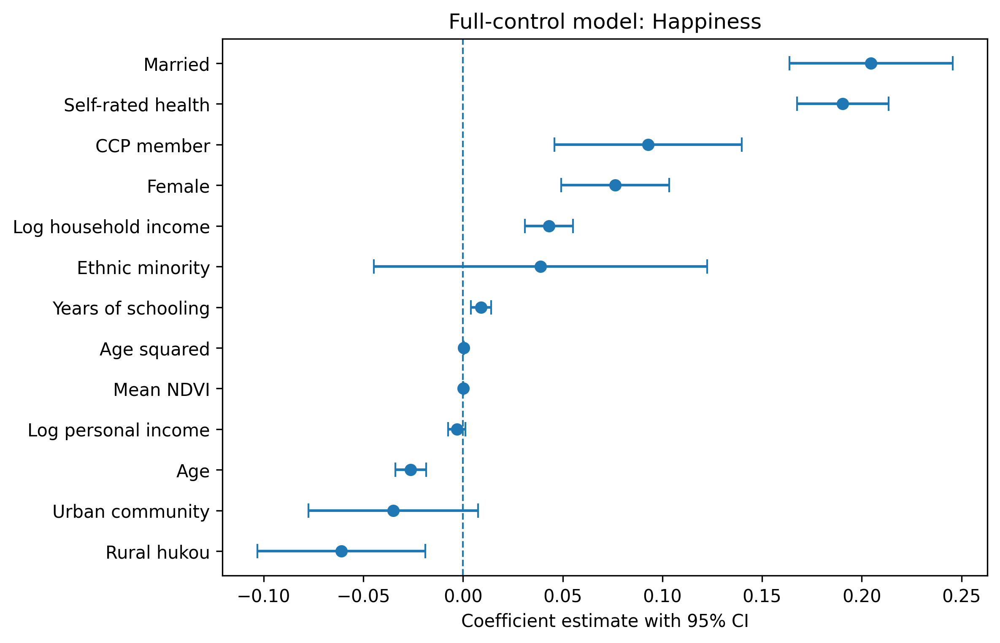
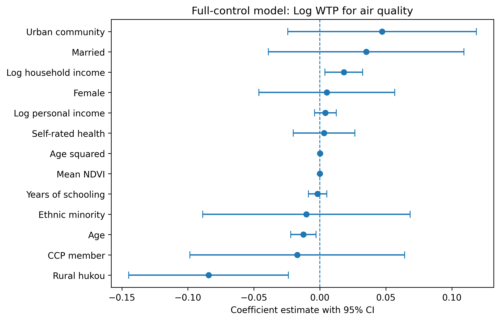
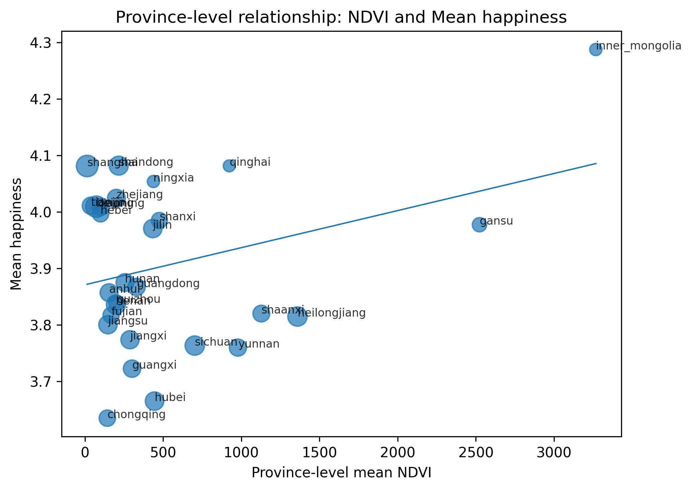
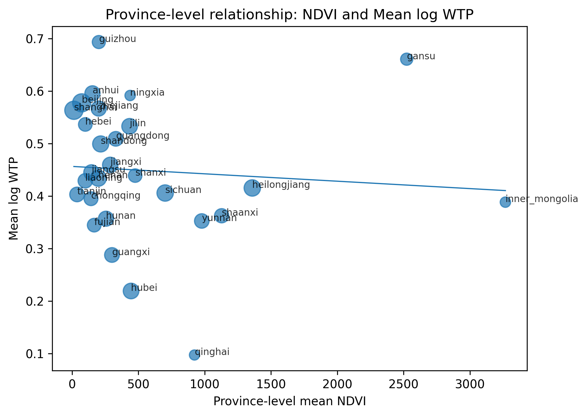

# Greenness, Happiness, and Willingness to Pay for the Environment: Evidence from China


## 0. Repository Structure

```text
final-project-greenness-infrastructure-happiness/
  boundary_data/
  CGSS2018/
  code/
  manifests/
  ndvi_outputs/
  regression_data/
  tasks_csv/
  visualization/
  README.md
```

The repo contains a pipeline to download links of NDVI data from NASA [download_nasa_ndvi.ipynb](download_nasa_ndvi.ipynb) and two key pipelines [complete_ndvi_workflow.ipynb](complete_ndvi_workflow.ipynb) and [launch_emr_prepare_regression.ipynb](launch_emr_prepare_regression.ipynb), which uses scripts stored in `code/`. Key code files include the NDVI processing script, the SQS worker script, the EC2 worker launcher, the task enqueueing script, the EMR regression script, and the visualization script. The final outputs are the regression tables in `regression_data/`, and figures in `visualization/`.


## 1. Research Question and Motivation

A large literature in economics and related fields suggests that the local environment may shape individual well-being. Greener areas may improve quality of life through cleaner air, lower heat exposure, and more pleasant surroundings, while more built-up areas may reflect either better infrastructure and services or greater congestion, pollution, and stress. While studies linking greenness and well-being are prevalent in the west, very few focus on China, which is a particularly interesting because it has experienced rapid urbanization alongside major environmental policy efforts. Additionally, most studies focus on objective health outcomes rather than subjective happiness. To fill in this gap, this project explores the relationship between happiness, greenness, and attitude towards the environment by asking the following research question:

**1. How does local greenness measure influence self-reported happiness in China?**
**2. What is the relationship between local greenness and people’s willingness to pay for environmental efforts?**

The empirical setting combines the China General Social Survey 2018 (CGSS 2018) with satellite-derived greenness measures from NASA Harmonized Landsat and Sentinel-2 vegetation-index products. The main individual-level outcomes are self-reported happiness and willingness to pay for government efforts to increase the number of days with good air quality. The main environmental exposure is annual province-level mean NDVI, a standard satellite-based proxy for vegetation greenness.

Greenness can affect well-being through multiple channels: cleaner local environments, better recreational amenities, lower heat exposure, improved mental health, and higher perceived quality of life. At the same time, greener provinces may have less perceived need for costly air-quality improvement, which could reduce stated willingness to pay. Therefore, the expected signs are not mechanically the same across outcomes. The project is observational and should not be read as causal evidence. Nevertheless, the project is useful because it demonstrates how to construct a scalable environmental-social data pipeline that links remote-sensing data to survey outcomes. 

## 2. Justification for Scalable Computing

This research problem requires scalable computing because the raw environmental data are not a small tabular dataset. The satellite source consists of many cloud-hosted raster files from NASA LP DAAC HLS-VI products. Each province-year task requires identifying relevant NDVI GeoTIFFs, downloading large files from protected NASA S3 storage, parsing metadata from filenames, grouping rasters by sensing date, mosaicking overlapping tiles, clipping raster mosaics to administrative boundaries, removing invalid or fill values, and computing daily and annual summary statistics. These operations are geospatially intensive and memory-intensive, especially for large provinces with many overlapping tiles.

A non-scalable workflow would require downloading all files manually to a local machine and running the raster computations one province at a time. That approach is fragile for three reasons. First, local storage and memory can become a bottleneck when the number of provinces, dates, and tiles increases. In this project, the satellite-processing pipeline used approximately 17,415 NDVI GeoTIFF items, corresponding to about 34 GB of satellite imagery. Second, NASA temporary S3 credentials expire, so long serial jobs are risky. Third, a manual workflow is difficult to reproduce because it depends on local file movement and ad hoc execution order.

In light of this, this project builds two connected pipelines that are designed to be scalable. First, this project builds an NDVI pipeline that uses SQS queue and EC2 workers to download satellite data and compute annual and provincial NDVI averages. The design separates the problem into independent province-level tasks. Each province can be processed separately because the annual NDVI summary for a province depends only on that province’s manifest file, the boundary file, and the common processing script. This “one province = one task” structure is naturally parallelizable. By using S3 for persistent storage, SQS for task scheduling, EC2 workers for distributed raster processing, the pipeline can scale beyond a single country while preserving reproducibility. For instance, computing NDVI for Asia or the whole world would be feasible with this NDVI pipeline as long as geoboundary data are accessible. Second, this project builds an EMR pipeline that uses EMR Spark for downstream regression after obtaining NDVI data from the first pipeline. The EMR cluster pipeline is scalable because in the EMR stage, Spark distributes the data-processing tasks across multiple executors. Additionally, after the NDVI pipeline produces province-level NDVI outputs in S3, EMR can read both the NDVI files and the CGSS happiness data directly from S3, which separates storage from computation. If the survey dataset becomes larger, or if the project is extended to multiple years, counties, or repeated satellite measures, the same code can scale by increasing the number of EMR core/task nodes rather than rewriting the workflow. 

## 3. Data Sources and Local cleaning

The social survey dataset is CGSS 2018. The cleaned survey file is stored locally as:

```text
CGSS2018/CGSS2018_clean_main.csv
```

The core outcomes are:

- `happiness`: self-reported happiness, originally CGSS variable `a36`, measured on a five-point scale.
- `wtp_air3`: willingness to pay for government efforts to increase the number of good-air-quality days in 2018 by three days, originally CGSS variable `e76b`.
- `ln_wtp_air3`: log-transformed willingness to pay, defined as `log(wtp_air3 + 1)`.

The environmental input is NASA HLS-VI NDVI, which is stored in NASA's official S3 bucket. The administrative boundary file is the China ADM1 GeoJSON boundary. According to these boundaries, links to HLS-VI NDVI data for each province in 2018 are searched and downloaded, keeping only `.NDVI.tif` files. The downloading pipeline is automated by interacting with NASA's public API: [download_nasa_ndvi.ipynb](download_nasa_ndvi.ipynb)

## 4. Testing NDVI Pipiline

Before running the full distributed pipeline, I tested the NDVI workflow locally and on a single EC2 instance using Shanghai as the pilot case. The testing workflow was designed to validate the geospatial logic before scaling to all provinces. The Earthdata Search download script originally contained about 140 HLS-VI file links for Shanghai in 2018. Since each granule includes multiple vegetation or water indices, I filtered the links to retain only the 14 `.NDVI.tif` files. This produced a Shanghai NDVI manifest that could be used by the processing script.

### 4.1. Local Testing
The local test verified that the raster files were correctly georeferenced, that the Shanghai Municipality polygon could be selected from the ADM1 boundary file, and that the script could parse sensing dates and MGRS tiles from HLS filenames. The script grouped rasters by date, mosaicked same-date tiles, clipped the raster to the Shanghai boundary, removed fill and invalid NDVI values, computed daily mean NDVI, and then averaged valid daily values to obtain a 2018 annual NDVI summary.

### 4.2. Cloud Testing
After the local test, I replicated the workflow on AWS EC2. The EC2 test used the following sequence: upload the processing script, boundary file, and Shanghai NDVI manifest to `s3://final-project-ndvi/`; launch an EC2 instance in `us-west-2`; create a Python geospatial environment using `venv` and `pip`; configure temporary NASA S3 credentials; download the NDVI files from NASA S3; run the province-level NDVI script; and upload the output CSVs back to the project S3 bucket. One important debugging issue was Windows line endings in manifest files. Hidden carriage returns caused AWS CLI downloads to fail with 404 errors because the object keys ended with `\r`. I fixed this by removing carriage returns from the manifest before downloading. The Shanghai EC2 test successfully processed 14 NDVI files across seven distinct valid dates and produced daily and annual NDVI output files. This validated the end-to-end cloud workflow before scaling.

## 5. Full Scalable Pipeline Workflow

The full pipeline generalizes the Shanghai test to all available Chinese provinces. The project bucket is:

```text
s3://final-project-ndvi/
```

The S3 layout is organized as follows:

```text
s3://final-project-ndvi/
  scripts/
  boundaries/
  manifests/
  tasks/
  outputs/
  regression/
```

The pipeline is as follows:


```text
Query NASA CMR API
Search HLS-VI NDVI links: year = 2018, cloud cover <= 10%
        |
        v
Create province-level NDVI manifests
one manifest per province
        |
        v
Upload manifests, boundary file, and scripts to S3
        |
        v
Create SQS task queue
one province = one SQS message
        |
        v
Launch EC2 workers and install packages for each worker
+----------------+----------------+----------------+
|                |                |                |
v                v                v
EC2 worker 1     EC2 worker 2     EC2 worker N
|                |                |
+----------------+----------------+
        |
        v
Each worker polls the SQS queue
        |
        v
receives one province task  <-----------------------------------------
        |                                                            |
        v                                                            |
download NDVI files from NASA protected S3                           |
Mosaic same-date tiles                                               |
clip to province boundary                                            |
remove invalid pixels                                                |
Compute daily and annual average NDVI for this province              |
        |                                                            |
        v                                                            |
Upload province-level NDVI outputs to S3 -------------> polls the SQS queue
        |
        v
Combine annual NDVI outputs across provinces
        |
        v
Final province-level NDVI dataset
        |
        v
Add cleaned CGSS 2018 survey data
        |
        v
Merge CGSS respondents with province-level NDVI
        |
        v
Run EMR Spark regressions
        |
        v
Regression tables and visualization figures
```

## 5.1 Computing Annual Average NDVI for Each Province
First, local code, province manifests, the boundary GeoJSON, and task CSVs are uploaded to S3. Second, an SQS queue named `ndvi-province-tasks` is created or reused. Each SQS message represents one province-processing job and contains the province name, the year, the manifest S3 path, the boundary S3 path, the processing script S3 path, and the output S3 folder. Third, three EC2 worker instances are launched. Each worker installs the required geospatial Python environment, downloads the worker script, polls the SQS queue, receives one province task, downloads the relevant manifest and boundary file, uses NASA temporary credentials to fetch NDVI GeoTIFFs from the protected NASA S3 bucket, runs the NDVI processing script, uploads daily and annual output CSVs to S3, and deletes the SQS message only after successful completion.

To make the NDVI computation scalable and stable on AWS EC2, I optimized the province-level processing script to avoid loading all satellite tiles into memory at once. The original version, which struggled with larger provinces in the full run, attempted to mosaic all intersecting HLS-VI NDVI rasters for the same date before computing the provincial mean, which was memory-intensive and could fail for large provinces. The optimized script instead processes rasters in smaller spatial blocks and handles tiles by coordinate reference system, reducing peak memory usage and avoiding errors caused by multi-CRS inputs. It computes valid NDVI statistics incrementally by clipping each raster block to the province boundary, excluding invalid or missing pixels, and accumulating valid pixel sums and counts before calculating the final daily and annual averages. This chunk-based design makes the script more robust on limited-memory EC2 instances, allows large provinces with many overlapping satellite scenes to be processed successfully, and preserves the same output structure required by the SQS–EC2–S3 pipeline.

This workflow is documented in:
[complete_ndvi_workflow.ipynb](complete_ndvi_workflow.ipynb)

This design is scalable because the queue decouples task creation from task execution. Adding more provinces does not require changing the processing logic. Adding more workers increases throughput because workers independently poll the queue. If a worker fails before completing a task, the message eventually becomes visible again after the SQS visibility timeout, allowing another worker to retry it. S3 serves as the durable storage layer for both inputs and outputs, which means workers are stateless and can be terminated after processing. The design also supports incremental execution: individual provinces can be rerun by reenqueuing their tasks without recomputing the entire project.

## 5.2. EMR Spark Regession
The downstream regression stage uses EMR Spark. After NDVI outputs are generated, province-level annual NDVI files are combined into a single regression input and uploaded to S3 along with the cleaned CGSS CSV. An EMR cluster is launched with Spark and a bootstrap action that installs Python packages such as `pandas`, `numpy`, and `statsmodels`. The regression script reads the CGSS and NDVI files from S3, normalizes province names, merges the datasets, constructs controls, estimates linear models for happiness and log willingness to pay, and writes regression tables and diagnostic files back to S3. The EMR stage is not strictly necessary for the small final regression table, but it demonstrates how the pipeline can handle larger survey datasets, repeated model specifications, or more granular environmental exposures in a scalable way.

The final regressions estimate the association between province-level mean NDVI and two outcomes:

```text
happiness ~ mean_ndvi + controls
ln_wtp_air3 ~ mean_ndvi + controls
```

The specifications are:

1. NDVI only.
2. NDVI plus demographic controls.
3. NDVI plus demographics and income controls.
4. NDVI plus full controls, including health, hukou status, marital status, CCP membership, and urban community status.

Standard errors are clustered by province in the `statsmodels` output. Province fixed effects are intentionally excluded because the greenness measure varies at the province-year level and the survey is a single cross-section from 2018. In a single-year province-level exposure design, province fixed effects would absorb the main NDVI variable.

This workflow is documented in:
[launch_emr_prepare_regression.ipynb](launch_emr_prepare_regression.ipynb)

## 6. Results and Visualization
The generated figures are saved in the project root under:

```text
visualization/
```

Main NDVI coefficient plots:




Full-control coefficient plots:




Province-level scatter plots:




Summary coefficient table:

[Main NDVI coefficient table](visualization/main_ndvi_coefficients_table.csv)

The results are noisy and should be interpreted as descriptive associations rather than causal estimates. The coefficient on NDVI is not statistically significant in the main models, but the signs are substantively reasonable. In the happiness regressions, the NDVI coefficient becomes positive after controls are added, which is confirmed by the scatterplot. This pattern is consistent with the idea that greener provinces may provide environmental amenities, recreational opportunities, and quality-of-life benefits that are positively correlated with subjective well-being. In the willingness-to-pay regressions, the NDVI coefficient is negative or close to zero. This sign is also plausible: respondents in greener places may perceive less need for additional environmental improvement, so their stated willingness to pay for more good-air-quality days may be lower.

The control variables behave more strongly than the NDVI measure. In the full happiness model, health, marriage, household income, hukou status, education, and age are more predictive than province-level greenness. This suggests that individual socioeconomic and demographic characteristics explain more of the variation in happiness than coarse province-level NDVI. For willingness to pay, household income and rural hukou are more informative than NDVI, while overall model fit remains low. This is unsurprising because stated WTP is likely affected by environmental attitudes, trust in government, perceived pollution exposure, and budget constraints, many of which are only imperfectly captured in the current specification.

The main substantive conclusion is therefore not that greenness has a precisely estimated effect, but that a scalable computing framework can successfully construct a remote-sensing exposure measure and link it to survey outcomes. The null and noisy estimates also motivate future improvements: using finer geographic identifiers, matching respondents to city- or county-level greenness, adding air pollution measures, distinguishing urban and rural exposure, and estimating heterogeneous effects by income, age, or hukou status.

## 7. Scalability and Reproducibility

The most important contribution of the project is the scalable architecture. The pipeline separates data storage, task scheduling, raster computation, and regression analysis into modular components. S3 stores all persistent inputs and outputs. SQS manages province-level task distribution. EC2 workers perform independent geospatial computation. EMR Spark handles the final data merge and regression workflow. This architecture avoids dependence on a single long-running local process and makes the project reproducible because every major input and output has a stable S3 location.

The same design can be extended easily. More years can be added by creating year-specific manifests and adding the year to each SQS task. More environmental measures can be added by changing the manifest filter from NDVI to EVI, NDWI, or other HLS-VI layers. More geographic precision can be added by replacing province boundaries with city, county, or grid-cell boundaries. Larger workloads can be handled by increasing the number of EC2 workers, using larger-memory instances for raster-heavy provinces, or splitting very large provinces into smaller spatial tiles. In this sense, the pipeline is not only a solution for this specific CGSS 2018 project, but also a general template for scalable social science research using satellite data and survey microdata.

## 8. Conclusion
In conclusion, this project shows how large-scale computing can make satellite-based social science research feasible and reproducible. By separating the workflow into NASA data discovery, S3 storage, SQS task distribution, EC2-based province-level NDVI processing, and EMR-based regression analysis, the pipeline scales from a single-province test to a full national workflow. Empirically, the estimated relationship between NDVI and survey outcomes is noisy, but the signs are broadly consistent with expectations: higher greenness is associated with higher reported happiness, while respondents in greener provinces appear less willing to pay for additional air-quality improvements. These results should be interpreted as descriptive rather than causal, especially because province-level NDVI is a coarse exposure measure. Still, the project demonstrates a scalable framework that can be extended to more years, finer geographic units, additional environmental indicators, and richer survey outcomes.


